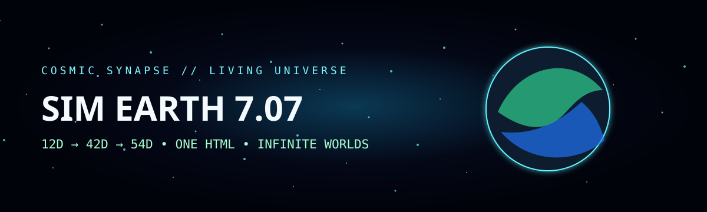

# 🌍 COSMIC SYNAPSE // THE LIVING UNIVERSE SIM ENGINE

<p align="center">
  
</p>

<p align="center">
  <strong>SIM EARTH 7.07</strong><br>
  A persistent living-universe simulation whose canonical engine still fits in one HTML file.
</p>

<p align="center">
  
  
  
  
  
  
  
</p>

> **One engine. One file. Persistent worlds. Device sensors. Procedural planets. 12D → 42D → 54D live state fusion.**

SIM EARTH 7.07 is the focused game/simulation branch of the Cosmic Synapse project. This repository intentionally contains only the living-universe simulation engine plus the material required to play, study, build, teach, package, validate, and publish it.

## 🚀 Play it

### 1. Standalone — no install
Download [`standalone/SIM_EARTH_7_07_ALIEN_CONTROL_CENTER.html`](standalone/SIM_EARTH_7_07_ALIEN_CONTROL_CENTER.html), open it in a modern browser, and press **INITIATE SIM EARTH 7.07**.

For camera, microphone, motion, geolocation, PWA installation, and consistent browser permissions, use an HTTPS deployment or run the included local server:

```bash
python tools/serve.py
```

Then open `http://localhost:7070/`.

### 2. iPhone / iPad
The immediate Apple install path is the PWA:
1. Open the GitHub Pages build in Safari.
2. Tap **Share**.
3. Tap **Add to Home Screen**.
4. Launch SIM EARTH 7.07 from its icon.

The repository also includes a Capacitor iOS wrapper path for Xcode, TestFlight, and App Store distribution. Physical-device/App Store packages must be signed with the publisher's Apple Developer identity.

### 3. Android
Install the PWA from Chrome, or use the GitHub Actions Android workflow to produce a debug APK artifact from the same web engine.

### 4. Windows / macOS / Linux
Use the PWA or build the Electron desktop shell. The desktop workflow targets Windows NSIS, macOS DMG/ZIP, and Linux AppImage/DEB.

---

## 👽 What is inside the engine?

The canonical standalone file preserves Genesis Engine ancestry and adds the SIM EARTH 7.07 living-universe layer:

- deterministic procedural worlds and terrain;
- Solar System reference worlds plus named procedural planets;
- first-person surface exploration and orbital modes;
- persistent local world state: biosphere, outposts, discoveries, anomalies, storms, and evolution;
- microphone FFT bands;
- camera luminance, variance, and motion estimates;
- geolocation, device orientation, and motion hooks where available;
- procedural audio driven by world/player state;
- a 12-channel sensory/CST state;
- a 42-channel world/context extension;
- a 54-channel adaptive state with Hebbian, plasticity, memory, and resonance channels;
- Lorenz-state integration and a bounded chaos proxy;
- derived gravity, escape velocity, density, atmospheric scale height, pressure, and orbital speed;
- Reality Lens mode, dimensional inspector, minimap, command deck, state export, and persistent ledger.

**Scientific framing:** 12D, 42D, and 54D are computational state-space dimensions/channels in this simulator. This repository does not present them as proof of additional physical spacetime dimensions. "Alien control center" is the game interface metaphor; the software does not physically actuate Earth, remote planets, or spacecraft.

## 🎮 Controls

| Action | Desktop | Mobile |
|---|---|---|
| Move | WASD | virtual stick |
| Look | mouse / drag | drag view |
| Jump | Space | JUMP |
| Sprint | Shift | SPRINT |
| Scan | E / control | SCAN |
| Toggle HUD | H | HUD control |
| Change world | command / destination panel | destination panel |
| Orbit / surface | mode controls | mode controls |

Useful commands:

```text
goto Mars
fold Europa
create Cory Prime
seed life
storm
outpost
anomaly
scan
reality
orbit
surface
day
night
time
```

## 🧠 12D → 42D → 54D

The active `CSTStateEngine` is explicit and inspectable.

**12D sensory/CST core**  
`frequency_mass`, `geometric_phase`, `spectral_flatness`, `phase_velocity`, `entanglement`, `valence`, `arousal`, `dominance`, `audio_psi`, `phi_harmonics`, `av_coherence`, `quantum_entropy`.

**42D extension** adds Lorenz state, chaos, tension/energy, spectral/vision signals, location and solar phase, planetary physics, terrain/ocean/biosphere/civilization, radiation/magnetic/resource/anomaly fields, memory coherence, novelty, instability, and coherence.

**54D adaptive layer** adds Hebbian strength, plasticity, attention, curiosity, avoidance, flora/black-hole biases, memory depth, prediction error, learning rate, resonance, and a singularity channel.

See [`docs/PHYSICS_AND_54D_STATE.md`](docs/PHYSICS_AND_54D_STATE.md).

## 📦 Repository map

```text
standalone/     canonical one-file game
app/            generated installable PWA surface + manifest/service worker
assets/         icon source for PWA/native packaging
desktop/        Electron desktop shell
scripts/        web preparation and hostile verification
tools/          zero-dependency local HTTPS-friendly development server
docs/           player, teacher, engineering, validation, and distribution guides
paper/          publication manuscript and Zenodo metadata template
.github/        Pages, validation, Android, iOS, and desktop build workflows
```

## 🛠 Build

The standalone game itself has no Node dependency. Packaging requires Node.js 20+.

```bash
npm install
npm run verify
npm run prepare:web
```

Native wrapper generation:

```bash
npm run native:android
npm run native:ios
```

Desktop:

```bash
npm run desktop
npm run dist:desktop
```

See [`docs/BUILD_AND_DISTRIBUTION.md`](docs/BUILD_AND_DISTRIBUTION.md).

## ✅ Verification philosophy

Claims are separated into:

- **implemented** — directly present and reproducible in code;
- **simulated / heuristic** — meaningful game or research instrumentation, not a claim of a new physical law;
- **research hypothesis** — requires controlled empirical validation outside the game.

Run:

```bash
npm run verify
```

The verifier checks the canonical SHA-256, required runtime classes, exact 12/42/54 array dimensions, PWA assets, and packaging surfaces.

## 📚 Documentation

- [Player Manual](docs/PLAYER_MANUAL.md)
- [Teacher Guide](docs/TEACHER_GUIDE.md)
- [Architecture](docs/ARCHITECTURE.md)
- [Physics + 54D State](docs/PHYSICS_AND_54D_STATE.md)
- [Build & Distribution](docs/BUILD_AND_DISTRIBUTION.md)
- [Research & Validation](docs/RESEARCH_GUIDE.md)
- [IP & Attribution](docs/IP_AND_ATTRIBUTION.md)
- [Technical Paper](paper/SIM_EARTH_7_07_TECHNICAL_PAPER.md)

## 📖 Research lineage & citation

**Creator:** Cory Shane Davis  
**Foundational CST publication:** *The 12-Dimensional Cosmic Synapse Theory: Audio-Driven Deterministic Cosmological Simulation with Adaptive Memory and Light Particle Mapping*  
**DOI:** `10.5281/zenodo.17574447`

That DOI is cited as lineage for the foundational CST work. It is not represented as a DOI for this repository release. When SIM EARTH 7.07 receives its own Zenodo DOI, replace the placeholder in `CITATION.cff` and `paper/zenodo.json`.

## ⚖️ Licensing

- **Software:** Apache License 2.0 — [`LICENSE`](LICENSE).
- **Documentation and paper:** CC BY 4.0 — [`LICENSE-DOCS.md`](LICENSE-DOCS.md).
- [`NOTICE`](NOTICE) preserves project attribution and CST lineage.
- Licensing is not a substitute for patent, trademark, or copyright-registration advice; see [`docs/IP_AND_ATTRIBUTION.md`](docs/IP_AND_ATTRIBUTION.md).

## 🌌 Design rule

> **Preserve ancestry. Add capability. Label simulations honestly. Let the universe remember.**
